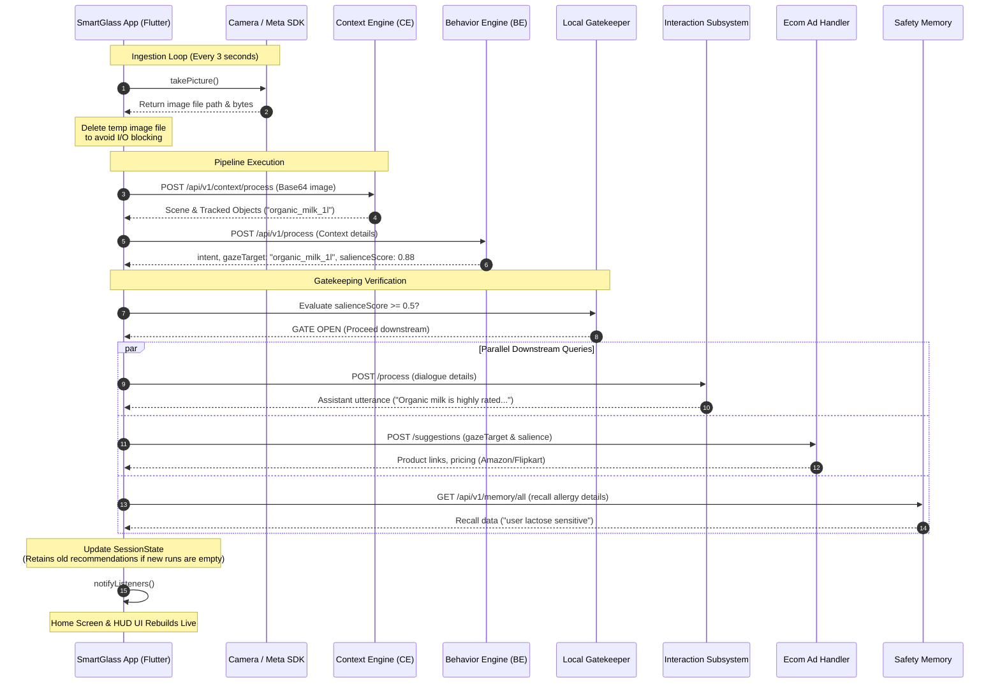

# Smart Myna: AI-Powered SmartGlass Platform Demo Guide

Welcome to the official **Smart Myna** developer demo guide! This document is curated to present the end-to-end user journey, core AI microservices, host-to-server communications, and the underlying architecture of the platform.

---

## 🎙️ Welcome & Introduction
> *"Imagine walking through a retail store. As you focus your gaze on a product, your smart glasses automatically detect it, understand your purchase consideration intent, fetch safety preferences, check your budget, and suggest direct e-commerce purchase links—all in real-time, hands-free, and under 60 milliseconds."*

This is **Smart Myna**—an AI-powered edge-to-cloud smart glasses shopping companion built on Flutter and powered by a distributed pipeline of specialized microservices.

---

## 🚀 End-to-End User Journey (Login to Checkout)

Here is the step-by-step path a user takes through the application:

```
[ Login Screen ] ➔ [ Connect Device ] ➔ [ Live Session (FOP) ] ➔ [ Home Screen (HUD) ] ➔ [ Store Checkout ]
```

### 1. Authentication
* **Screen**: [login_screen.dart](file:///c:/Users/kumar/OneDrive/Desktop/smartGlassApp%20demo/smartglass_flutter/lib/features/auth/login_screen.dart)
* **Action**: Users sign in using secure corporate/dev credentials:
  * `davidkumar@glassdata.ai` (Password: `david@Admin123`)
  * `padmsunk@glassdata.ai` (Password: `santhel@Admin123`)
  * `manojd@glassdata.ai` (Password: `manoj@Admin123`)
* **How it works**: The app calls `auth.login(email, password)` which matches against the predefined credentials list and caches the session token in `SharedPreferences`.

### 2. Device Pairing & Ingestion Start
* **Screen**: [devices_screen.dart](file:///c:/Users/kumar/OneDrive/Desktop/smartGlassApp%20demo/smartglass_flutter/lib/features/devices/devices_screen.dart)
* **Action**: The user connects to their smart glasses (or selects the phone camera/video upload source) and navigates to the **FOP Dashboard**.
* **How it works**: Tapping **Start Session** activates the `StreamCoordinator`, which registers location/audio listeners and sets up a periodic camera capture timer in `CameraService`.

### 3. Real-Time Processing (FOP Dashboard)
* **Screen**: [dashboard_screen.dart](file:///c:/Users/kumar/OneDrive/Desktop/smartGlassApp%20demo/smartglass_flutter/lib/features/dashboard/dashboard_screen.dart)
* **Action**: Displays live video previews, frame diagnostics, latency analytics, and raw JSON context logs returned by the engines.

### 4. Interactive Recommendation Hub
* **Screen**: [home_screen.dart](file:///c:/Users/kumar/OneDrive/Desktop/smartGlassApp%20demo/smartglass_flutter/lib/features/home/home_screen.dart)
* **Action**: When looking at objects (e.g. shoes, milk), the **Focus & Behavioral Intent** card displays live gaze data. Salient object chips and suggested products slide in.
* **Aesthetics**: Glassmorphism metrics display with real-time progress bars for Salience and Intent Confidence.

### 5. Instant Checkout Redirection
* **Action**: Tapping any product chip triggers `_openEcommerceForObject` to search for matching links (e.g., Amazon, Flipkart) and launches them.
* **Robustness**: Visual loading SnackBars notify the user, and a stateful debounce prevents duplicate external page triggers that cause Android app crashes.

---

## 🛠️ Microservice Architecture & Host-to-Server Communication

Smart Myna is built on a modular microservice pipeline. Each request is executed asynchronously using a unified client architecture with **Retry Policies** (2 attempts with exponential backoff) and **Circuit Breakers** (stops sending queries if a service is down, preventing app freezes).

### The Ingestion Loop & API Endpoints

```
[ Camera Frame ] ➔ [ Context Engine ] ➔ [ Behavior Engine ] ➔ [ Gate Check ] ➔ [ Downstream Engines ]
```

### 1. Context Engine (CE)
* **Endpoint**: `https://myna-ce-dev.glassdata.ai/api/v1/context/process`
* **Purpose**: Performs object detection and identifies the general scene.
* **Request Payload**:
  ```json
  {
    "image": "data:image/jpeg;base64,...",
    "location": { "latitude": 12.9716, "longitude": 77.5946 },
    "audio_level": 0.04
  }
  ```
* **Response Payload**:
  ```json
  {
    "scene": "retail_store",
    "tracked_objects": [
      { "object_id": 102, "label": "organic_milk_1l", "confidence": 0.94 }
    ],
    "top_salient_objects": ["organic_milk_1l"]
  }
  ```

### 2. Behavior Engine (BE)
* **Endpoint**: `https://myna-be-dev.glassdata.ai/api/v1/process`
* **Purpose**: Evaluates user eye-gaze and hand movements to calculate product salience.
* **Request Payload**:
  ```json
  {
    "context_data": {
      "scene": "retail_store",
      "tracked_objects": [{"object_id": 102, "label": "organic_milk_1l"}]
    },
    "timestamp": 1780714415600
  }
  ```
* **Response Payload**:
  ```json
  {
    "intent": "purchase_consideration",
    "confidence": 0.92,
    "gaze_target": "organic_milk_1l",
    "salience_score": 0.88
  }
  ```

### 3. Local Gate-Keeping Subsystem (GateCheck)
* **Implementation**: Local verification logic in `GateCheckStep`.
* **Action**: If `salience_score` < `0.5` or `gaze_target` is `"unknown"`, it **gates/suppresses** queries to the Interaction and E-commerce APIs. This saves network bandwidth and battery. If the user looks at a product (score >= 0.5), it unlocks the gateway.

### 4. Interaction Subsystem (SME)
* **Endpoint**: `https://myna-sme-dev.glassdata.ai/process`
* **Web Fallback Gateway**: `https://myna-sme-dev.glassdata.ai/api/release` (GET url-encoded to bypass CORS origin-locks)
* **Purpose**: Generates conversational text feedback from a LLM.
* **Request Payload**:
  ```json
  {
    "dialogue_mode": "query",
    "utterance": "User looking at organic_milk_1l",
    "bcp": { "relevance_score": 0.88, "behavioral_state": "purchase_consideration" }
  }
  ```
* **Response Payload**:
  ```json
  {
    "dialogue_mode": "recommendation",
    "last_utterance": "That organic milk is highly rated! Would you like to check out details?",
    "llm_gate_status": "open"
  }
  ```

### 5. E-commerce Ad Handler (AH)
* **Endpoint**: `https://myna-ah-dev.glassdata.ai/api/v1/ecom/suggestions`
* **Purpose**: Queries inventory database for live prices and links.
* **Request Payload**:
  ```json
  {
    "gaze_target": "organic_milk_1l",
    "intent_scoring": { "salience_score": 0.88, "class_name": "organic_milk_1l" }
  }
  ```
* **Response Payload**:
  ```json
  {
    "status": "success",
    "suggestions": [
      {
        "id": "https://www.amazon.in/dp/B0CL7CMTXS",
        "name": "Organic Milk 1L - Farm Fresh",
        "price": 3.49,
        "image_url": "https://m.media-amazon.com/images/I/image.jpg"
      }
    ]
  }
  ```

### 6. Safety Memory Service
* **Endpoint**: `https://myna-sme-dev.glassdata.ai/api/v1/memory/all`
* **Purpose**: Recalls user preference histories or allergy warnings.
* **Request Payload**:
  ```json
  { "query": "organic_milk_1l", "timestamp": 1780714415620 }
  ```
* **Response Payload**:
  ```json
  {
    "status": "success",
    "semantic_memories": [
      { "memory_id": "mem_01", "content": "user lactose sensitive", "memory_type": "allergy" }
    ]
  }
  ```

---

## 🗺️ System Use Case Diagram

The following diagram illustrates how users interact with the app, meta SDK, and backend API servers:

```mermaid
usecaseDiagram
    actor User as "User (SmartGlass Wearer)"
    actor SDK as "Meta Glasses SDK"
    actor Server as "AI Engine Servers"

    User --> (Sign In to App)
    User --> (Start Streaming Session)
    User --> (Look at Retail Products)
    User --> (Tap Recommendations to Buy)

    (Start Streaming Session) --> SDK : "Capture Video/Audio Feed"
    SDK --> (Process Ingestion Loop) : "Provide Frame Bytes"
    (Process Ingestion Loop) --> Server : "Execute Pipeline Queries"
    Server --> (Generate Recommendations) : "Return Context & E-commerce Links"
    (Generate Recommendations) --> User : "Display Product Cards & Intent HUD"
```

---

## 🔄 Sequence Diagram: End-to-End Processing Loop

The sequence diagram details the chronological execution flow for a single camera frame:



---

## ⚡ Robustness & Performance Features (Realme Device Optimized)

To prevent app crashes, freezes, and lags on physical mobile devices (like the **Realme RMX3998**), the app incorporates three key performance optimizations:

1. **LatestFrameWins Drop Policy**: The pipeline processes one frame at a time. If the pipeline is busy when a new camera frame is captured, the older stashed frame is dropped in favor of the freshest one, keeping queue depth at `0` or `1` and avoiding memory build-up.
2. **Periodic Image Cleanup**: After a photo is captured by `takePicture()`, read as bytes, and sent, the app deletes the temporary physical file from the disk asynchronously. This preserves flash write cycles and avoids I/O bottlenecks.
3. **Redirection Debouncing**: Tapping product cards registers a visual loader SnackBar and blocks subsequent taps until the URL is successfully handed over to the Android OS browser activity, preventing multiple threads from launching the browser concurrently.
