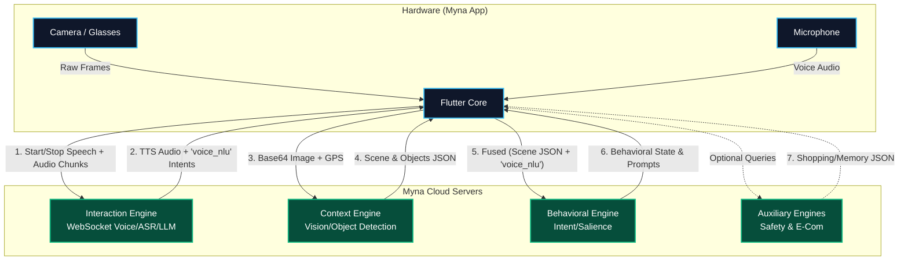

# Myna Smart Glass - V.0.1 Maintenance & Developer Guide

This document is the official developer manual for Myna V.0.1. It explains the core architecture, which files control specific features, how they link together, and where to look when issues arise.

---

## 1. Core Architecture Overview
The Myna Flutter application is designed to be the "Hardware Bridge" between the physical Smart Glasses (or phone) and the Cloud Python AI Backend. 
The app is entirely responsible for:
- Capturing Audio, Video, and GPS Location
- Detecting voice activity (VAD) locally
- Sending raw data to the backend via WebSocket
- Receiving AI text and playing TTS audio back to the user

---

## 2. Directory Structure & Key Files

### Audio & Voice Activity Detection (VAD)
**File:** `lib/core/services/audio_stream_manager.dart`
- **What it does:** Captures raw microphone data, runs the Silero VAD neural network, and handles WebSocket transmission.
- **Linked to:** `session_provider.dart` (which initializes it) and `camera_preview_card.dart` (which listens to the `isSpeakingStream` to show the red microphone icon).
  - **Issue: App picks up too much background noise (Continuous VAD Loop):** The primary cause of continuous VAD loops on Android is the `maxAmplitude` fallback. Set `maxAmplitude > 0.5` instead of `0.4` to filter out background static and fans.
  - **Issue: VAD doesn't trigger at all (App feels deaf):** Some Android hardware (like Realme/RMX3998) have extremely quiet microphones. The neural net (`Silero`) alone will fail to detect speech. You **must** rely on the amplitude fallback (`maxAmplitude > 0.5`) alongside a sensitive Silero threshold (`threshold: 0.3`).
  - **Issue: Microphone feels unresponsive while waiting for AI:** The VAD lock `_waitingForMIISResponse` has been completely removed to allow conversational barge-in. Do not re-add it or the app will feel unresponsive while the server processes the LLM response.
  - **Issue: WebSocket fails to connect:** Check `_scheduleReconnect()` and ensure `_channel?.sink.close()` is called before recreating it.

### Global State & Dependency Injection
**File:** `lib/core/providers/session_provider.dart`
- **What it does:** The central brain of the app. It initializes all services (Camera, Audio, Location, Meta SDK) and manages the application state.
- **Linked to:** Every UI screen (`dashboard_screen.dart`, `engine_inspector_screen.dart`).
- **Where to edit for issues:**
  - **Issue: Services not starting up:** Check the `_initClients()` function.
  - **Issue: Adding a new SDK:** You will inject new SDK instances here (like the new official Smart Glass SDK you mentioned) and add a new `SourceAdapter`.

### User Interface (UI)
**File:** `lib/features/dashboard/dashboard_screen.dart`
- **What it does:** The main visual interface.
- **Linked to:** `camera_preview_card.dart`, `action_hub_tab.dart`, `file_upload_widget.dart`.
- **Where to edit for issues:**
  - **Issue: UI not updating when speaking:** Look inside `camera_preview_card.dart` for the `StreamBuilder` that listens to the `isSpeaking` state.

---

## 3. Maintenance Guidelines

### Updating the Smart Glass SDK
When you integrate the new official SDK for the Smart Glass:
1. Create a new service file (e.g., `lib/core/services/official_glasses_sdk_service.dart`).
2. Create a new source adapter (e.g., `lib/core/sources/official_glass_adapter.dart`) that implements `SourceAdapter`.
3. In `session_provider.dart`, inject this new adapter into the `SourceManager`.
4. Update the `SourceType` enum in `source_manager.dart` to include `officialGlass`.

### Troubleshooting Backend Connection Drops
If the backend starts dropping connections (like the 504 Gateway Timeout or Connection Refused errors):
1. **Always check the Nginx Gateway logs first.** If Nginx returns 504, the Flutter app is working perfectly, but the Python container is hung.
2. **Check the Python Server ASR.** If the Flutter logs show `[VAD] Speech started` and `Backend Transcript: ""`, the Python server's speech-to-text model is crashing or offline. The app is rarely to blame for silence.

### Performance & Memory
- The Silero VAD model runs locally on the phone. Do not decrease the VAD frame size (32ms / 512 samples) or the Android OS may kill the audio thread for memory consumption (`AudioEffect: not enough memory`). 
- Keep the `1.0x` digital gain on Android microphones. Physical hardware on budget Android devices varies heavily. 

---

## 4. End-to-End Data Flow & API Endpoints

The Flutter app acts as a real-time sensor node, collecting data and routing it to the appropriate microservices on the Myna Cloud Server.

### Visual Architecture Flowchart



### Synchronized Sequence Diagram (Voice & Behavior Fusion)

This sequence diagram illustrates the exact sequence when a user speaks (e.g., *"I want to buy this"*). It demonstrates the 15-second voice intent injection and the VAD lock that protects the microphone during ASR/TTS.

```mermaid
sequenceDiagram
    participant Mic as Mic / VAD
    participant App as Flutter App
    participant MIIS as Interaction Engine
    participant BE as Behavioral Engine

    Note over Mic,App: User speaks: "I want to buy this"
    Mic->>App: VAD triggers Speech Start
    App->>MIIS: {type: start_of_speech, context: last_BIE_frame}
    App->>App: Lock VAD (_waitingForMIISResponse = true)
    
    Mic->>MIIS: PCM Audio Chunks
    
    Mic->>App: VAD detects silence (Timeout)
    App->>MIIS: {type: end_of_speech}
    
    MIIS-->>App: {type: transcript, text: "I want to buy this"}
    
    Note over MIIS: FSM + LLM processing
    MIIS-->>App: {type: audio_chunk, data: TTS...}
    
    MIIS-->>App: {type: status, bcp: {voice_nlu: {active_intent: buyProduct}}}
    App->>App: Unlock VAD (_waitingForMIISResponse = false)
    
    Note over App: App sets _activeVoiceNlu & starts 15s Timer
    
    loop Every 200ms (Camera Frames)
        App->>BE: POST /process + {voice_nlu: {active_intent: buyProduct}}
        BE-->>App: BIE Frame (behavioral_state: purchase_consideration)
    end
    
    Note over App: After 15s Timer expires
    App->>App: _activeVoiceNlu cleared
```### Voice & Conversation Flow (Interaction Engine)
1. **Audio Capture:** `flutter_pcm_sound` continuously records raw 16000Hz, 16-bit Mono audio.
2. **VAD Processing:** `flutter_silero_vad` analyzes frames locally. If speech is detected, the app opens the WebSocket.
3. **Endpoint:** `wss://myna-ie-dev.glassdata.ai/ws`
   - **Payload Sent:** JSON `{ "type": "start_of_speech" }` followed by binary RAW PCM audio chunks, ending with `{ "type": "end_of_speech" }`.
   - **Payload Received:** JSON `{ "type": "transcript", "data": { "text": "..." } }`.
4. **GPS Sync:** During the conversation, the app posts the user's location to tie into the Interaction Engine's awareness.
   - **Endpoint:** `POST https://myna-ie-dev.glassdata.ai/set_location`
   - **Payload:** `{ "latitude": float, "longitude": float }`

### Visual Analysis Flow (Context Engine)
1. **Camera Capture:** Frame captured via Smart Glasses (Meta SDK) or the Phone Camera.
2. **Vision Processing:** The image is converted to Base64 and sent to the Pipeline Coordinator.
3. **Endpoint:** `POST https://myna-be-dev.glassdata.ai/api/v1/process`
   - **Payload:** `{ "image": "base64_string", "session_id": "...", "timestamp": "..." }`
   - **Payload Received:** Scene descriptions, bounding boxes for objects, and optical character recognition (OCR) text.

### Auxiliary Engines (REST API)
Depending on the pipeline results, the app may query secondary engines:
- **Safety Memory Engine:** `GET /api/release` - Recalls allergies, hazards, and geofencing warnings based on the current GPS coordinates.
- **Behavior Engine:** `GET /api/v1/user/behavior` - Fetches user behavioral insights (wellness, habit tracking).
- **E-Commerce Engine:** `GET /api/v1/shopping/suggestions` - Detects products in the visual feed and retrieves purchasing links and price estimates.
