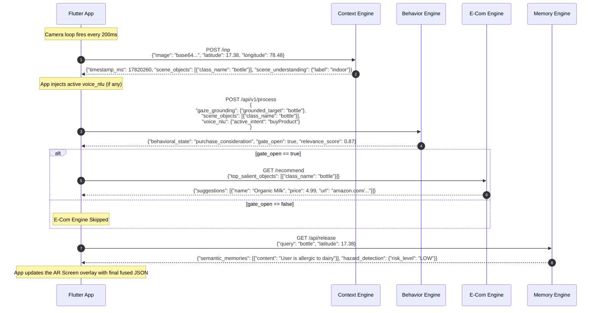

# Myna Engine Master Integration Guide

This document is your **single source of truth** for understanding the codebase. It details all 5 micro-engines, exactly how they talk to the Flutter app, how data flows between them, and exactly which files you need to edit when you want to make a change.

---

## 1. The Big Picture: The Two Pipelines

The Myna Architecture is split into two distinct, continuous loops that run simultaneously and inject data into each other.

1. **The Visual Loop (REST API):** Runs continuously at ~5 frames per second. It takes what the camera sees and feeds it through a chain of 4 sequential REST APIs (`Context` -> `Behavior` -> `E-Com` -> `Memory`).
2. **The Voice Loop (WebSocket):** Sits idle until the microphone detects speech (VAD). Once you speak, it streams audio to the `Interaction Engine`, gets your intent (`voice_nlu`), and **injects** that intent into the Visual Loop.

---

## 2. Engine Breakdown & API Connections

### A. Context Engine (The Eyes)
* **What it does:** Looks at the raw camera frame and detects objects and scene labels (e.g., it sees a bottle).
* **API:** `POST /inp`
* **Takes:** Base64 Image string + GPS coordinates.
* **Gives:** `scene_understanding` and a list of `top_salient_objects` (with bounding boxes).
* **Where to edit in Flutter:** 
  - `lib/core/engines/context/context_client.dart` (API Calls)
  - `lib/core/orchestrator/steps/context_engine_step.dart` (Formatting the input)

### B. Behavior Engine (The Brain)
* **What it does:** Looks at what the Context Engine saw, and decides what the user's intent is (e.g., "User is looking at a bottle, they are in *purchase_consideration*").
* **API:** `POST /api/v1/process`
* **Takes:** The exact JSON output from the Context Engine **PLUS** the `voice_nlu` if the user just spoke.
* **Gives:** `behavioral_state` (e.g., `purchase_consideration`), `gate_open` (true/false if ready to talk), and `relevance_score`.
* **Where to edit in Flutter:** 
  - `lib/core/engines/behavior/behavior_client.dart` (API Calls)
  - `lib/core/orchestrator/steps/behaviour_intent_step.dart` (Injecting `voice_nlu` into the request)

### C. Interaction Engine (The Mouth & Ears)
* **What it does:** Listens to the user's microphone, translates speech to text, extracts intent (`voice_nlu`), and speaks back (TTS).
* **API:** `wss://host:8001/ws` (WebSocket)
* **Takes:** `{type: "start_of_speech", context: <BehaviorEngineOutput>}` followed by binary audio chunks.
* **Gives:** `voice_nlu` (e.g., `{active_intent: "buyProduct"}`), text transcripts, and raw TTS audio bytes to play through speakers.
* **Where to edit in Flutter:** 
  - `lib/core/services/audio_stream_manager.dart` (VAD, WebSocket connection, and TTS playback)
  - `lib/core/providers/session_provider.dart` (Extracting `voice_nlu` from the WebSocket and holding it for 15 seconds)

### D. E-Commerce Engine (The Store)
* **What it does:** If the Behavior Engine says the user wants to buy something, this engine looks up prices and shopping links.
* **API:** `GET /buy` or `GET /recommend`
* **Takes:** The objects the Behavior engine flagged as important.
* **Gives:** `suggestions` (A list of products with prices, ratings, and checkout links).
* **Where to edit in Flutter:** 
  - `lib/core/engines/ecom/ecom_client.dart`
  - `lib/core/orchestrator/steps/ecom_ad_step.dart`

### E. Safety Memory Engine (The Guardian)
* **What it does:** Checks if the user has any saved allergies or is in a dangerous GPS zone based on what they are looking at.
* **API:** `GET /api/release`
* **Takes:** The current GPS coordinates and the `gazeTarget` from the Behavior Engine.
* **Gives:** `semantic_memories` (e.g., "User is allergic to peanuts").
* **Where to edit in Flutter:** 
  - `lib/core/engines/memory/memory_client.dart`
  - `lib/core/orchestrator/steps/safety_memory_step.dart`

---

## 3. Comprehensive Visual Data Flow (With Payloads)

This sequence diagram illustrates exactly what the Flutter App is doing under the hood, step-by-step, including the full JSON payloads moving between the physical phone and the Cloud AI Engines.

---

## 4. Cheat Sheet: "I want to change X, where do I go?"

| Goal | File to Edit |
|------|-------------|
| "I want to change the visual overlay or what text is shown on screen." | `lib/features/home/home_screen.dart` |
| "I want to fix microphone echoes or VAD sensitivity." | `lib/core/services/audio_stream_manager.dart` |
| "I want to change how the payloads are formatted before sending to Python." | `lib/core/engines/shared/mappers/request_mappers.dart` |
| "I want to add a new engine or re-order how they run." | `lib/core/orchestrator/pipeline_coordinator.dart` |
| "I want to track how variables are stored globally (like the 15s voice timer)." | `lib/core/providers/session_provider.dart` |

---

## 5. UI Mapping: Where to Find Everything on the Screen

If you need to change how the app looks, or edit how the AI's output is beautifully rendered on the screen (e.g. Navigation bars, E-Com product links, AI Assistant popups), here is exactly where those widgets live:

### A. The Outer Shell (Nav Bar & Background)
- **File:** `lib/features/shell/app_shell.dart`
- **What it does:** This controls the main wrapper of the app, including the bottom navigation bar and the overall scaffolding.

### B. The AI Voice Assistant (Microphone & TTS)
- **File:** `lib/features/shell/widgets/myna_assistant_bottom_sheet.dart`
- **What it does:** This is the popup tray at the bottom. It holds the Microphone icon (which you long-press to manually barge in) and displays the live captions of what the AI is saying (`last_utterance`).

### C. The Main Dashboard (Camera & Engine Hub)
- **File:** `lib/features/dashboard/dashboard_screen.dart`
- **What it does:** The primary screen showing the camera feed and rendering the tabs.

### D. The Output Cards (Product Links & E-Com Results)
- **Files:** 
  - `lib/features/dashboard/widgets/normal_user_cards.dart` (For the beautiful, consumer-facing UI)
  - `lib/features/dashboard/widgets/action_hub_tab.dart` (For raw E-Com data)
- **What it does:** These files are responsible for taking the massive merged JSON from the E-Com Engine and rendering it beautifully on screen (e.g. showing "Organic Milk - $4.99" with a clickable navigation link to Amazon).

---

## 6. Important System Behaviors

### User Barge-In (Microphone Interruption)
- **Manual Push-to-Talk (Enabled):** The user can interrupt the AI at any time by **long-pressing** the microphone icon in `myna_assistant_bottom_sheet.dart`. This triggers `audioStreamManager.startRecording()` and immediately sends a `{"type": "user_interruption"}` over the WebSocket.
- **Voice-Activated Barge-In (Disabled):** The user cannot interrupt the AI just by speaking over it. To prevent permanent Acoustic Echo loops on Android hardware, the app explicitly locks the microphone (`_isPlaying`) while the AI is talking.

### Exact Backend URLs (The `.env` File)
The app dynamically loads its endpoints from the `.env` file via `lib/core/config/env_config.dart`. The most critical endpoint for Voice Communication is:
- **WebSocket URL:** `wss://myna-ie-dev.glassdata.ai/ws`

The E-Com / Action Hub endpoints triggered by the Behavior Engine are:
- `GET https://myna-ah-dev.glassdata.ai/recommend`
- `GET https://myna-ah-dev.glassdata.ai/buy`
- `GET https://myna-ah-dev.glassdata.ai/analyze`
- `GET https://myna-ah-dev.glassdata.ai/lifebalance`

---

## 7. Explicit Architecture Confirmations & Code References

This section confirms exactly how the theoretical flow is implemented in the codebase, with direct file and line references.

### 1. "Context engine gets inputs -> merges with voice_nlu -> goes to Behavior engine -> produces outputs"
**Code Reference:** `lib/core/orchestrator/pipeline_coordinator.dart` (Lines 80-100) & `lib/core/orchestrator/steps/behaviour_intent_step.dart`
- **First:** The Pipeline Coordinator runs `ContextEngineStep`.
- **Second:** It takes that exact Context output, merges it with the 15s `voice_nlu` from the `StreamCoordinator`, and runs `BehaviourIntentStep` to get the behavioral output.

### 2. "Interaction engine is active at voice communication and has the context of the Behavior engine"
**Code Reference:** `lib/core/services/audio_stream_manager.dart` (Line 204) & `lib/core/providers/session_provider.dart`
- **When you speak:** The VAD triggers `start_of_speech` and the app immediately injects the `lastBIEFrame` (which is the output from the Behavior Engine) into the WebSocket payload.

### 3. "E-Com ad handler gets inputs from the Behavior engine outputs and triggers exactly 4 endpoints"
**Code Reference:** `lib/core/engines/ecom/ecom_client.dart` (Lines 31-84)
- **Exactly 4 Endpoints:** The `EcomClient` first sends a `POST /inp` with the Behavior engine's objects. Then it triggers a `Future.wait` that hits all 4 endpoints simultaneously in parallel:
  1. `GET /recommend`
  2. `GET /buy`
  3. `GET /analyze`
  4. `GET /lifebalance`
- **Merge & Render:** It merges the responses from all 4 of these together and passes them to the Flutter UI so the product links can be rendered beautifully.

### 4. "Safety memory should trigger all the time"
**Code Reference:** `lib/core/orchestrator/pipeline_coordinator.dart` (Lines 110-120)
- **Continuous Execution:** In the `runPipeline` function, the `SafetyMemoryStep` is at the very end of the loop. Unlike the E-Com engine (which only triggers if `gate_open` is true), the Safety Engine is executed on **every single frame cycle**, constantly checking GPS and scene objects for hazards.
