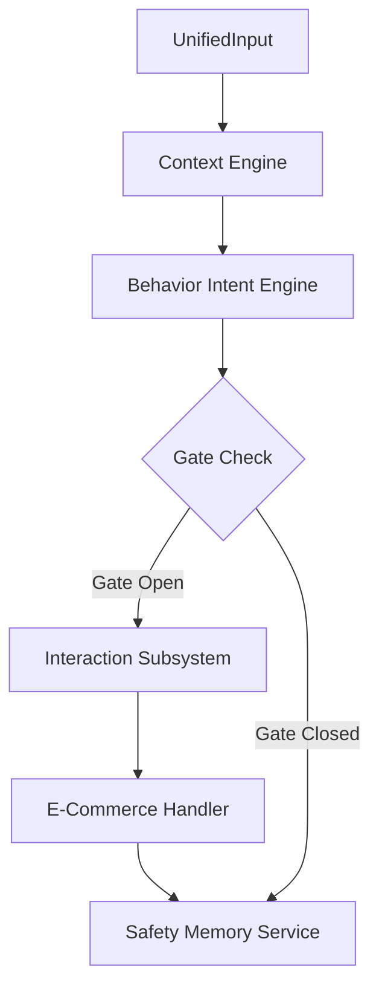
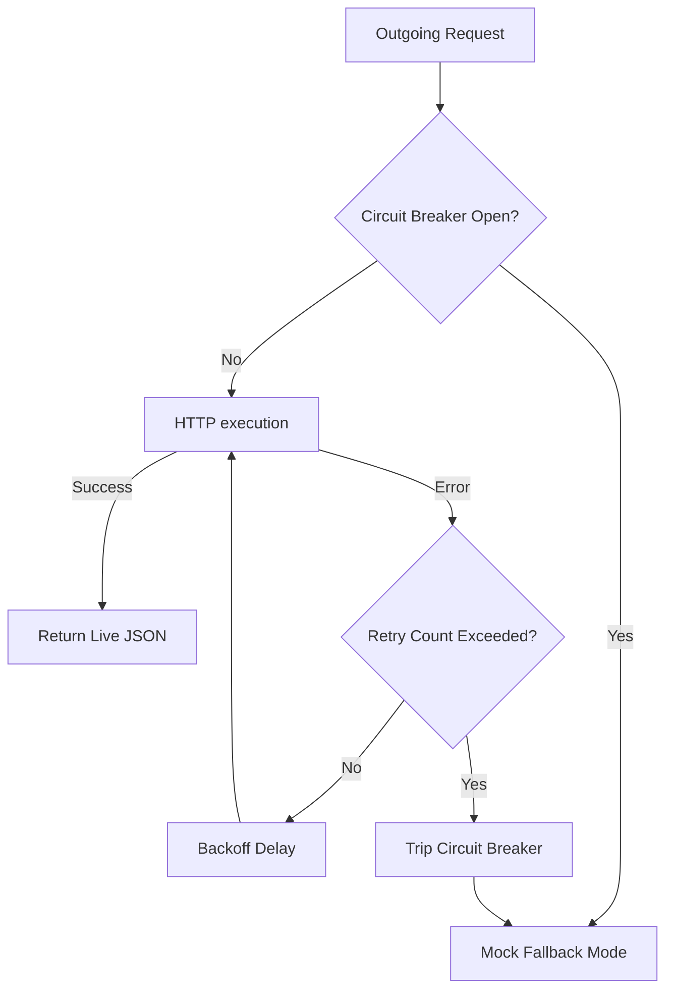

# SmartGlass AI Ecosystem: API & Interface Specifications
This document provides a comprehensive technical reference of the client classes, API endpoints, query parameters, payload interfaces, response schemas, and resilience behaviors for the **SmartGlass Myna AI Ecommerce platform**. Use this reference during the technical code review.

---

## 1. Pipeline Input Schema (`UnifiedInput`)

The pipeline processes high-frequency sensor streams packed into a single, structured model before routing to the orchestration pipeline.

* **Class Definition**: [`UnifiedInput`](file:///c:/Users/kumar/OneDrive/Desktop/smartGlassApp%20demo/smartglass_flutter/lib/core/models/unified_input.dart#L26-L42)
* **Fields**:
  * `videoFrame` (`VideoFrame?`): Contains image payload as `Uint8List` bytes, resolution `width` and `height`.
  * `audioChunk` (`AudioChunk?`): Contains list of fluctuating `double` audio frequency values representing microphone levels.
  * `location` (`LocationData?`): Geolocation coordinates (`latitude` and `longitude`).
  * `source` (`MediaSource`): Source identifier (`MediaSource.META`, `MediaSource.PHONE`, `MediaSource.WEB`, or `MediaSource.MOCK`).
  * `timestamp` (`int`): Ephemeral epoch millisecond timestamp.

---

## 2. Five-Stage Orchestration Pipeline APIs

The orchestration is executed by the [`PipelineCoordinator`](file:///c:/Users/kumar/OneDrive/Desktop/smartGlassApp%20demo/smartglass_flutter/lib/core/orchestrator/pipeline_coordinator.dart#L20-L49), processing tasks sequentially:



---

### Phase 1: Context Engine

Provides visual and spatial scene understanding, tracking items, and establishing user focus.

* **Client Class**: [`ContextClient`](file:///c:/Users/kumar/OneDrive/Desktop/smartGlassApp%20demo/smartglass_flutter/lib/core/engines/context/context_client.dart#L9-L23)
* **API Endpoint**: `POST /predict` (Default: `http://3.6.10.81:8501/predict`)
* **Dart API Signature**:
  ```dart
  Future<Map<String, dynamic>> sendContext({
    required Uint8List imageBytes,
    required List<double> audioFeatures,
    required double latitude,
    required double longitude,
  })
  ```
* **JSON Request Interface**:
  ```json
  {
    "image": "base64EncodedString...",
    "audio": [0.12, 0.45, 0.08],
    "location": {
      "latitude": 37.7749,
      "longitude": -122.4194
    },
    "timestamp": 1717320000000
  }
  ```
* **JSON Output Schema**:
  ```json
  {
    "scene_context": {
      "scene_label": "User walking in retail store",
      "scene_confidence": 0.92
    },
    "tracked_objects": [
      {
        "object_id": 102,
        "label": "organic_milk_1l",
        "bbox_xyxy": [100.0, 150.0, 300.0, 450.0],
        "confidence": 0.94
      }
    ],
    "product_salience": {
      "102": 0.925
    },
    "attention_grounding": {
      "attention_target": "organic_milk_1l",
      "attention_confidence": 0.91
    }
  }
  ```

---

### Phase 2: Behavior & Intent Engine

Analyzes the context output alongside temporal states to evaluate gaze grounding and user voice commands.

* **Client Class**: [`BehaviorClient`](file:///c:/Users/kumar/OneDrive/Desktop/smartGlassApp%20demo/smartglass_flutter/lib/core/engines/behavior/behavior_client.dart#L8-L21)
* **API Endpoint**: `POST /behavior` (Default: `http://3.6.10.81:8502/behavior`)
* **Dart API Signature**:
  ```dart
  Future<Map<String, dynamic>> sendBehavior(Map<String, dynamic> contextData)
  ```
* **JSON Request Interface**:
  ```json
  {
    "context_data": {
      "scene_context": { "scene_label": "User walking in retail store" },
      "tracked_objects": [{ "object_id": 102, "label": "organic_milk_1l" }]
    },
    "timestamp": 1717320000000
  }
  ```
* **JSON Output Schema**:
  ```json
  {
    "timestamp_ms": 1717320000000,
    "gaze_grounding": {
      "grounded_target": "organic_milk_1l",
      "alignment_score": 0.88
    },
    "voice_nlu": {
      "active_intent": "queryProduct",
      "slots": {
        "product_name": "organic_milk_1l",
        "attribute": "price"
      }
    }
  }
  ```

---

### Phase 3: Gate Check (Local Step)

Evaluates whether the user's intent or visual engagement level justifies triggering the downstream generative AI agents. This step reduces latency and unnecessary compute usage.

* **Class**: [`GateCheckStep`](file:///c:/Users/kumar/OneDrive/Desktop/smartGlassApp%20demo/smartglass_flutter/lib/core/orchestrator/steps/gate_check_step.dart)
* **API Signature**:
  ```dart
  Future<StepResult<bool>> execute(BIEFrame input, Map<String, dynamic> sharedState)
  ```
* **Behavior Rules**:
  * Returns `true` if voice intent is active (`intent != 'unknown'`) OR gaze target is active with high visual salience (`salienceScore > 0.5`).
  * If `false`, the pipeline immediately skips downstream interaction/ecom processing, executing only the memory logging phase.

---

### Phase 4: Interaction Subsystem

Coordinates conversational states and runs dialogues to output textual audio responses for the user's smart glasses speaker.

* **Client Class**: [`InteractionClient`](file:///c:/Users/kumar/OneDrive/Desktop/smartGlassApp%20demo/smartglass_flutter/lib/core/engines/interaction/interaction_client.dart#L8-L21)
* **API Endpoint**: `POST /process` (Default: `http://3.6.10.81:8001/process`)
* **Dart API Signature**:
  ```dart
  Future<Map<String, dynamic>> sendInteraction(Map<String, dynamic> requestPayload)
  ```
* **JSON Request Interface**:
  ```json
  {
    "intent": "queryProduct",
    "gaze_target": "organic_milk_1l",
    "timestamp_ms": 1717320000000
  }
  ```
* **JSON Output Schema**:
  ```json
  {
    "dialogue_mode": "RECOMMENDATION",
    "last_utterance": "That organic milk is highly rated! Would you like to check details?",
    "bcp": {
      "behavioral_state": "purchase_consideration",
      "relevance_score": 0.885,
      "gate_open": true
    }
  }
  ```

---

### Phase 5: E-Commerce Handler

Fetches active listings, calculates optimal deals, and yields recommendations based on currently visible products.

* **Client Class**: [`EcomClient`](file:///c:/Users/kumar/OneDrive/Desktop/smartGlassApp%20demo/smartglass_flutter/lib/core/engines/ecom/ecom_client.dart#L8-L21)
* **API Endpoint**: `POST /query` (Default: `http://3.6.10.81:5000/query`)
* **Dart API Signature**:
  ```dart
  Future<Map<String, dynamic>> queryEcom(Map<String, dynamic> requestPayload)
  ```
* **JSON Request Interface**:
  ```json
  {
    "salient_objects": ["organic_milk_1l"],
    "interaction_mode": "RECOMMENDATION"
  }
  ```
* **JSON Output Schema**:
  ```json
  {
    "status": "success",
    "suggestions": [
      {
        "id": "milk_102",
        "name": "Organic Whole Milk 1L",
        "price": 3.49,
        "image_url": "https://assets.glassdata.ai/products/milk_102.png"
      }
    ]
  }
  ```

---

### Phase 6: Safety Memory Service

Persists user context semantic memories (like allergies, preferences) in a remote database and recalls them dynamically to prevent unsafe ecommerce interactions.

* **Client Class**: [`MemoryClient`](file:///c:/Users/kumar/OneDrive/Desktop/smartGlassApp%20demo/smartglass_flutter/lib/core/engines/memory/memory_client.dart#L8-L21)
* **API Endpoints**: 
  * `POST /store`: Save semantic preferences.
  * `POST /recall`: Query matching memories.
* **Dart API Signature**:
  ```dart
  Future<Map<String, dynamic>> storeMemory(Map<String, dynamic> payload)
  Future<Map<String, dynamic>> recallMemory(Map<String, dynamic> payload)
  ```
* **JSON Request Interface (Recall)**:
  ```json
  {
    "query": "Is the user allergic to anything?",
    "top_k": 3,
    "confidence_threshold": 0.4
  }
  ```
* **JSON Output Schema (Recall)**:
  ```json
  {
    "status": "success",
    "semantic_memories": [
      {
        "memory_id": "mem_4a8f9",
        "content": "user allergic to cups",
        "memory_type": "allergy",
        "relevance_score": 0.95
      }
    ]
  }
  ```

---

## 3. Resilience, Fault Tolerance & Fallback Design

Our clients implement a three-tier resilience strategy to guarantee that the smart glass runtime continues to function reliably under changing network conditions.



### 1. Exponential Backoff & Retry
If an HTTP request fails due to transient connection issues, the request retries up to **2 times** (3 attempts total) with exponential backoff:
* **Implementation Class**: [`RetryPolicy`](file:///c:/Users/kumar/OneDrive/Desktop/smartGlassApp%20demo/smartglass_flutter/lib/core/engines/shared/retry_policy.dart)

### 2. Circuit Breaker Pattern
To avoid cascading delays, if an engine experiences repeated failures, the client trips a circuit breaker and blocks subsequent calls for a cooldown period:
* **Implementation Class**: [`CircuitBreaker`](file:///c:/Users/kumar/OneDrive/Desktop/smartGlassApp%20demo/smartglass_flutter/lib/core/engines/shared/circuit_breaker.dart)

### 3. Graceful Mock Fallbacks (Resilience Shield)
When `fallbackToMock: true` is configured in production builds (see [`SessionProvider`](file:///c:/Users/kumar/OneDrive/Desktop/smartGlassApp%20demo/smartglass_flutter/lib/core/providers/session_provider.dart#L301-L305)), any HTTP error or timeout is caught, and a structured, high-fidelity mock payload is returned immediately. This guarantees that the UI dashboard, Meta Stream view, and pipeline run seamlessly even when specific backend components are offline.
